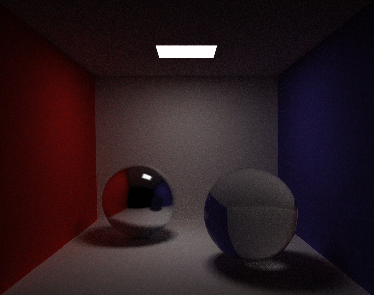
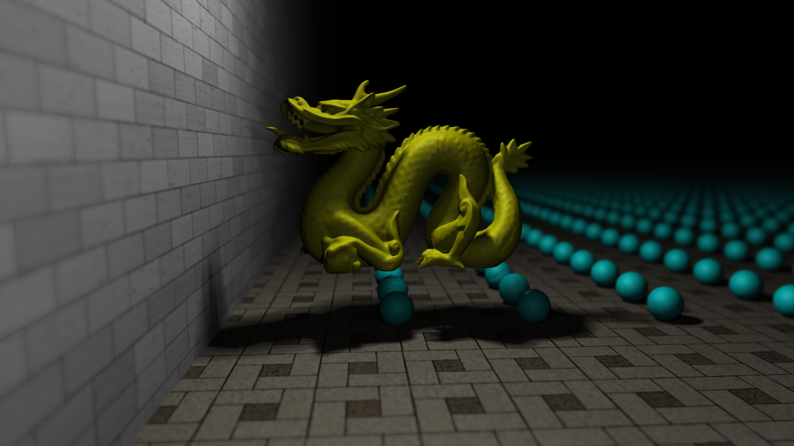
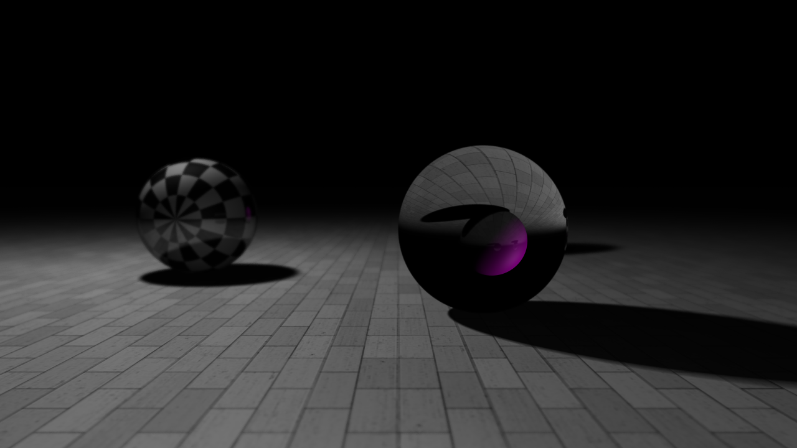
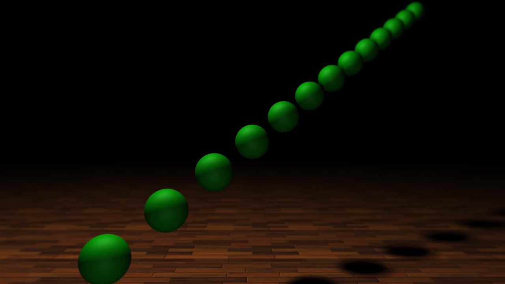

This is a photo-realistic ray tracing renderer written in C++.
## Dependencies

+ Visual Studio 2017
+ glm
+ OpenCV 3.1.0

## Features

+ Monte Carlo Path Tracing & Bidirectional Path Tracing.
+ Some BSDFs like Lambertian, Phong, smooth dielectric.
+ Rendering of infinite plane, sphere and obj mesh model.
+ Reflection & refraction.
+ Area light.
+ Anti aliasing & Depth of field.
+ Texture including pure color, grid texture and image texture.
+ Implemented <a href="http://www.eng.utah.edu/~cs6965/papers/kdtree.pdf">SAH-based</a> KD-Tree.
+ Smooth shading.

## Gallery

+ Render two balls in Cornell Box with 100spp by using bidirectional path tracing.

+ Stanford dragon and 10,000 spheres with depth-of-field & anti-aliasing & soft shadow.

+ Two spheres with dof & anti-aliasing & soft shadow.

+ Several spheres with with dof & anti-aliasing & soft shadow.

