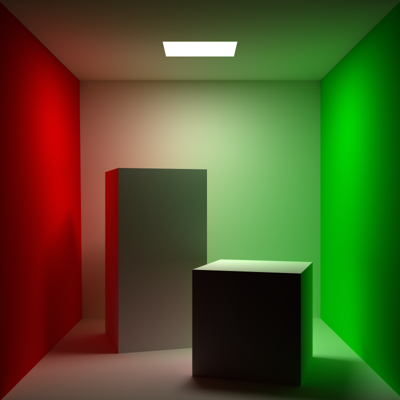
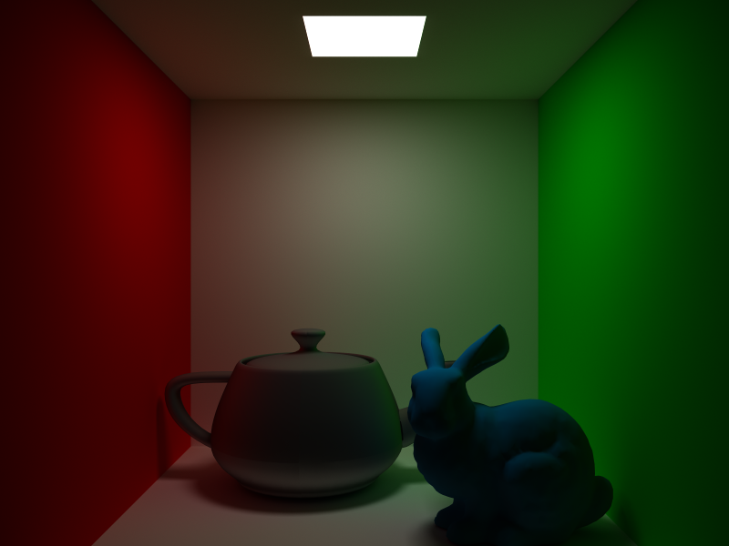
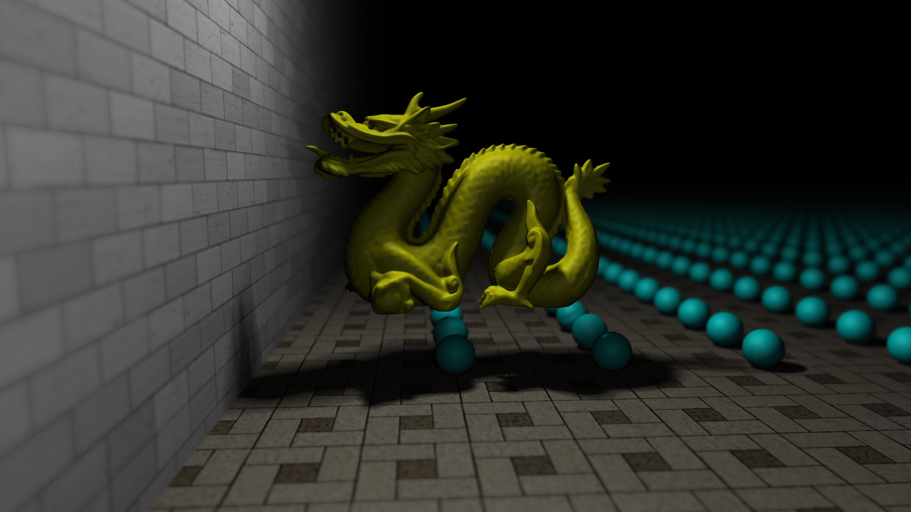
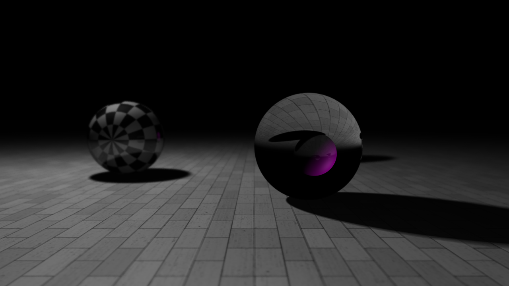
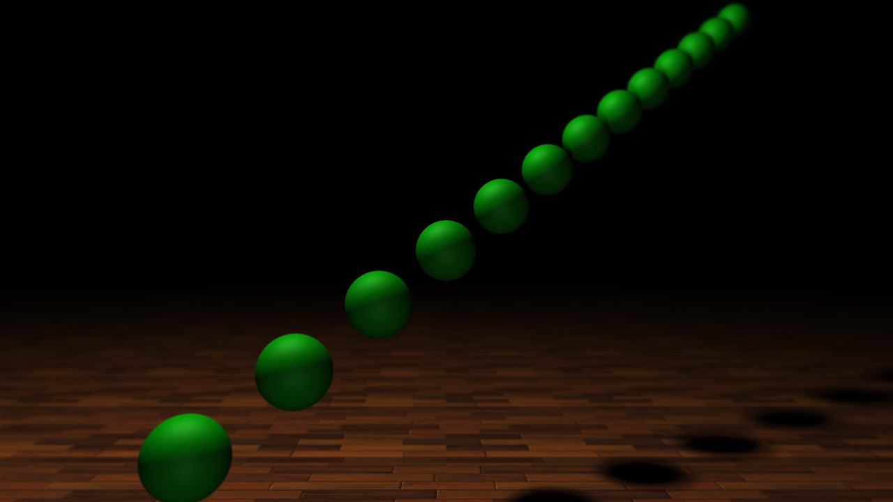

This is a photo-realistic ray tracing renderer written in C++. Also as a course project, you can see <a href="https://github.com/nero19960329/RayTracer/blob/master/report.pdf">ray tracing</a> and <a href="https://github.com/nero19960329/RealTimeGI/blob/master/report/report.pdf">mcpt</a> reports.

## Dependencies

+ Visual Studio 2013
+ OpenCV 3.1.0
+ Matlab libraries

## Use

command line:

```
RayTracer.exe [scene name] -travel/-render [saving image name]*(only for render mode)
```

Some example scene files can be found in "scene/".

## Features

+ <a href="https://en.wikipedia.org/wiki/Phong_reflection_model">Phong model</a> in ray tracing, phong & lambertian model in monte carlo path tracing.
+ Rendering of infinite plane, sphere and obj mesh model.
+ Reflection & refraction.
+ Orthographic projection & perspective projection.
+ Soft shadow.
+ Anti aliasing by jitter sampling.
+ Depth of field by super sampling.
+ Texture including pure color, grid texture and image texture.
+ Implemented <a href="http://www.eng.utah.edu/~cs6965/papers/kdtree.pdf">SAH-based</a> KD-Tree.
+ Smooth shading.

## Gallery

+ Cornell box with 20000spp.
<div style="text-align:center; margin-top:30px"></div>

+ Utah teapot & Stanford bunny in Cornell box with 10000spp.
<div style="text-align:center; margin-top:30px"></div>

+ Stanford dragon and 10,000 spheres with depth-of-field & anti-aliasing & soft shadow.
<div style="text-align:center; margin-top:30px"></div>

+ Two spheres with dop & anti-aliasing & soft shadow.
<div style="text-align:center; margin-top:30px"></div>

+ Several spheres with with dop & anti-aliasing & soft shadow.
<div style="text-align:center; margin-top:30px"></div>